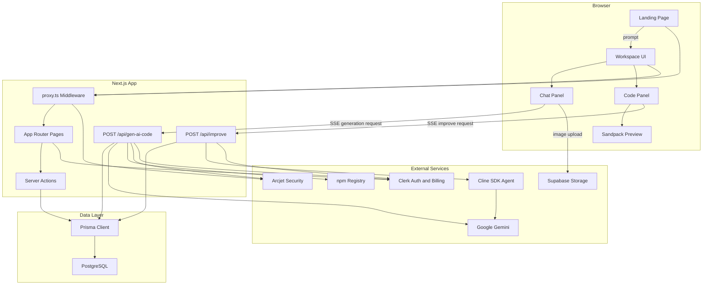

# Bloom Project Overview

Bloom is an AI app builder. A user describes an app in natural language, and Bloom generates a working React app, shows it in a live browser preview, lets the user continue improving it through chat, and stores each generated project as a workspace.

The project is built as a single Next.js application. It combines a marketing landing page, an authenticated app-building workspace, server APIs for AI generation, database persistence, billing/credits, security checks, image uploads, and an in-browser code preview.

## What This App Does

Bloom helps users go from an idea to a runnable frontend app.

- A user enters a prompt such as "Build a kanban board with drag and drop".
- The app sends the prompt to Gemini.
- Gemini returns a full React file tree and package list.
- Bloom validates generated dependencies and saves the result.
- The generated app is rendered instantly using Sandpack.
- The user can continue chatting to change the app.
- Pro users can use the Bloom Agent, powered by the Cline SDK, to improve existing files.
- Users can export the generated project as a ZIP file.

In short, Bloom is a prompt-to-React-app builder with live preview, persistence, credits, authentication, and AI-powered iteration.

## High-Level Architecture



## Main User Flow

1. The user lands on `/` and enters a prompt.
2. If the user is not signed in, Clerk opens the sign-in flow.
3. If signed in, the app navigates to `/workspace?prompt=...`.
4. The workspace page loads the current user, credits, plan, and optional existing workspace.
5. `ChatPanel` auto-submits the initial prompt.
6. `WorkspaceClient` sends a streaming request to `/api/gen-ai-code`.
7. The API authenticates the user, checks credits, runs Arcjet protection, calls Gemini, validates packages, saves the workspace, and decrements credits.
8. The client receives Server-Sent Events and updates the chat, status log, generated files, workspace id, and remaining credits.
9. `CodePanel` passes the generated files to Sandpack so the app can run in the browser.
10. The user can continue prompting, fix preview errors, export a ZIP, or use the Pro-only improve agent.

## Project Structure

```text
ai-app-builder/
+-- app/
|   +-- page.tsx
|   +-- layout.tsx
|   +-- globals.css
|   +-- (auth)/
|   +-- (main)/
|   +-- api/
+-- actions/
+-- components/
+-- lib/
+-- prisma/
+-- public/
+-- types/
+-- proxy.ts
+-- next.config.ts
+-- prisma.config.ts
+-- package.json
+-- vercel.json
```

### `app/`

This folder uses the Next.js App Router.

- `app/page.tsx` is the marketing landing page and first prompt input.
- `app/layout.tsx` wraps the app with `ClerkProvider`, theme handling, the global header, and toast notifications.
- `app/(auth)/` contains Clerk sign-in and sign-up pages.
- `app/(main)/workspace/page.tsx` loads the authenticated workspace experience.
- `app/(main)/projects/page.tsx` displays saved projects.
- `app/api/gen-ai-code/route.ts` is the main AI generation endpoint.
- `app/api/improve/route.ts` is the Pro agent improvement endpoint.
- `app/globals.css` contains Tailwind CSS 4 setup and global theme styles.

### `components/`

This folder contains the client UI.

- `WorkspaceClient.tsx` is the central coordinator for messages, files, credits, generation, improvement, stopping requests, and state updates.
- `ChatPanel.tsx` renders the chat interface, credit display, message stream, image upload, and prompt input.
- `CodePanel.tsx` renders the Sandpack preview/code view, preview error handling, ZIP export, and Improve with Bloom Agent UI.
- `Header.tsx` and `HeaderNav.tsx` render navigation and user controls.
- `ProjectCard.tsx` renders saved workspace cards.
- `PricingModal.tsx` shows Clerk pricing inside a modal.
- `components/ui/` contains reusable shadcn-style UI primitives.
- `components/reusables.tsx` contains shared title/section typography helpers.

### `actions/`

This folder contains server actions and server-side data helpers.

- `actions/workspace.ts` loads the current workspace user and a workspace by id.
- `actions/projects.ts` lists and deletes projects owned by the current user.

### `lib/`

This folder contains shared server/client utilities and configuration.

- `lib/prisma.ts` creates the Prisma client.
- `lib/checkUser.ts` syncs Clerk users into the database and updates plan/credits.
- `lib/constants.ts` defines plans, credit amounts, pricing metadata, and credit cost.
- `lib/arcjet.ts` configures Arcjet API protection.
- `lib/data.ts` stores landing page marketing copy, feature lists, suggestions, and placeholders.
- `lib/utils.ts` contains the `cn()` class name utility.

### `types/`

This folder contains shared TypeScript types.

- `types/workspace.ts` defines workspace, message, generated file, and status types.
- `types/project.ts` defines saved project summary types.
- `types/plans.ts` defines the plan union type.

### `prisma/`

This folder contains the database schema and migrations.

- `prisma/schema.prisma` defines `User` and `Workspace`.
- `prisma/migrations/` contains migration history.

### Root Config Files

- `proxy.ts` runs Clerk middleware and Arcjet protection before requests reach pages/API routes.
- `next.config.ts` marks Cline packages as server external packages.
- `vercel.json` enables Vercel Fluid behavior for longer-running API routes.
- `package.json` defines scripts and dependencies.
- `postcss.config.mjs`, `eslint.config.mjs`, `tsconfig.json`, and `components.json` configure tooling.

## Core Runtime Pieces

### Landing Page

The landing page is in `app/page.tsx`. It shows the product pitch, rotating prompt placeholders, suggested prompts, feature sections, and Clerk pricing.

When a signed-in user submits a prompt, the app navigates to:

```text
/workspace?prompt=<encoded prompt>
```

That query parameter becomes the initial generation request.

### Workspace

The workspace is the main app-building screen. It has two primary panels:

- `ChatPanel` on the left for conversation, status updates, image upload, and credits.
- `CodePanel` on the right for previewing, inspecting, improving, and exporting the generated app.

`WorkspaceClient` owns the shared state between both panels:

- current `workspaceId`
- chat `messages`
- user `credits`
- generated `fileData`
- generation status
- improve-agent status
- abort controllers for stopping requests

### Generated App Preview

`CodePanel` uses Sandpack from `@codesandbox/sandpack-react`.

Sandpack runs generated React files directly in the browser. The required generated entrypoint is always:

```text
/App.js
```

The generated code is JavaScript, not TypeScript. Tailwind is expected for styling. The exported ZIP includes a small Create React App style project with Tailwind loaded from CDN.

### Saved Projects

Each generated app is stored as a `Workspace` record. The projects page reads all workspaces for the signed-in user and shows them as project cards.

Deleting a project uses a server action and only deletes workspaces owned by the current user.

## AI Generation Flow

The main generation endpoint is `POST /api/gen-ai-code`.

It receives:

- `workspaceId`, if editing an existing workspace
- `userId`, the database user id
- `messages`, the current conversation
- `fileData`, the current generated files if they exist

The endpoint then:

1. Authenticates with Clerk.
2. Checks the request with Arcjet.
3. Finds the database user.
4. Checks whether the user has at least one credit.
5. Builds Gemini conversation contents.
6. Sends the request to Gemini using `gemini-3.5-flash`.
7. Streams status updates back to the browser using Server-Sent Events.
8. Parses Gemini's JSON response.
9. Validates AI-selected npm packages against the npm registry.
10. Creates or updates a workspace.
11. Deducts one credit.
12. Sends the final generated files back to the browser.

The expected AI response shape is:

```json
{
  "assistantMessage": "Brief explanation of what was built",
  "title": "Short app title",
  "files": {
    "/App.js": {
      "code": "..."
    }
  },
  "dependencies": {
    "some-package": "latest"
  }
}
```

## Improve Agent Flow

The improve endpoint is `POST /api/improve`.

This is separate from the normal generation endpoint. It is only available to Pro users.

The endpoint receives:

- `userId`
- `workspaceId`
- `userRequest`
- current `fileData`

The endpoint then:

1. Authenticates with Clerk.
2. Loads the database user.
3. Blocks non-Pro users.
4. Checks credits.
5. Starts a Cline SDK `Agent`.
6. Gives the agent the current generated files as context.
7. Provides two tools: `update_file` and `done_improving`.
8. Streams agent thinking and file patches over Server-Sent Events.
9. Saves the patched `fileData`.
10. Deducts one credit.
11. Sends the final summary and updated files to the client.

The important difference is:

- Normal generation asks Gemini to return the complete app JSON.
- Improve mode uses an agent loop that can call tools to update specific files.

## Data Model

The database has two main models.

### User

`User` stores the app-level user record linked to Clerk.

Important fields:

- `id`: internal database id
- `clerkId`: Clerk user id
- `name`: user's display name
- `email`: user's email
- `imageUrl`: Clerk profile image
- `credits`: remaining generation/improvement credits
- `plan`: current plan, such as `free`, `starter`, or `pro`
- `workspaces`: relation to generated projects

### Workspace

`Workspace` stores each generated app.

Important fields:

- `id`: workspace id
- `title`: generated app title
- `userId`: owner id
- `messages`: JSON chat history
- `fileData`: JSON generated app files, dependencies, and title
- `createdAt` and `updatedAt`: timestamps

The app does not store generated source files as real files on disk. It stores them as JSON in Postgres.

## Packages And What They Do

### Framework And Runtime

- `next`: The main framework. Provides App Router pages, API routes, server components, and deployment conventions.
- `react` and `react-dom`: The UI runtime for the Bloom app.
- `typescript`: Type checking for the source code.

### AI And Agent System

- `@google/genai`: Calls Gemini for app generation.
- `@cline/sdk`: Runs the Pro improve agent with tool calling.
- `zod`: Defines the schemas for Cline agent tools in the improve endpoint.

### Authentication And Billing

- `@clerk/nextjs`: Handles sign-in, sign-up, user sessions, route protection, user data, plan checks, and pricing UI.

### Database

- `prisma`: Database schema and migration tooling.
- `@prisma/client`: Generated Prisma database client.
- `@prisma/adapter-pg`: Prisma adapter for PostgreSQL.
- `pg`: PostgreSQL driver.

### Preview And Export

- `@codesandbox/sandpack-react`: Runs generated React apps inside the browser.
- `@codesandbox/sandpack-themes`: Provides the Dracula Sandpack editor theme.
- `jszip`: Creates downloadable ZIP files for generated apps.

### Security

- `@arcjet/next`: Adds bot detection, request shielding, rate limiting, prompt-injection detection, and sensitive-info checks.

### Storage

- `@supabase/supabase-js`: Uploads user-provided reference images to a Supabase Storage bucket named `workspace-images`.

### UI And Styling

- `tailwindcss` and `@tailwindcss/postcss`: Styling system.
- `shadcn`: Component scaffolding and UI conventions.
- `@base-ui/react`: UI primitives used by parts of the app.
- `lucide-react`: Icons.
- `next-themes`: Dark/light theme support.
- `sonner`: Toast notifications.
- `react-markdown`: Renders assistant messages as Markdown.
- `react-spinners`: Loading animation in the code panel.
- `class-variance-authority`, `clsx`, and `tailwind-merge`: Class name and variant utilities.
- `tw-animate-css`: Animation utilities.

### Potentially Unused Or Scaffolded Packages

- `xod` appears in `package.json` but is not used by the current app code.
- `motion` is only used by `components/animate-ui/components/backgrounds/hole.tsx`, which appears to be an unused/scaffolded visual component.

## Different Kinds Of Dependencies

This project has three different dependency layers that are easy to confuse.

### 1. Bloom App Dependencies

These are in `package.json`. They are the dependencies needed to run Bloom itself.

Examples:

- Next.js
- Clerk
- Prisma
- Gemini SDK
- Sandpack
- Supabase
- Arcjet

These packages power the actual product.

### 2. Sandpack Base Dependencies

These are defined inside `components/CodePanel.tsx` as `BASE_DEPENDENCIES`.

They are made available to generated apps in the browser preview. Examples include:

- `lucide-react`
- `recharts`
- `framer-motion`
- `react-router-dom`
- `date-fns`
- `zod`
- `react-hook-form`
- Radix UI packages
- `axios`

These packages are for apps generated by Bloom, not necessarily for Bloom's own interface.

### 3. AI-Generated Dependencies

Gemini can return a `dependencies` object for extra packages needed by the generated app.

Before saving them, `/api/gen-ai-code` checks each package against the npm registry. Invalid or unreachable packages are ignored.

These dependencies are merged with the Sandpack base dependencies and included when exporting the generated app as a ZIP.

## Integrations

### Clerk

Clerk handles authentication and billing.

The app uses Clerk for:

- Sign-in and sign-up
- User session access
- Protected routes
- Pricing UI
- Plan checks through `auth().has({ plan })`

`lib/checkUser.ts` syncs the Clerk user into the local database. New users get the free plan and 10 credits.

### Gemini

Gemini is the primary AI model provider.

The app uses `gemini-3.5-flash` for:

- Generating the initial app
- Updating the app during normal chat iterations
- Powering the Cline SDK improve agent

### Cline SDK

The Cline SDK powers Bloom's Pro improve agent.

Instead of returning one big JSON response, the agent can call tools:

- `update_file`: rewrites a generated file
- `done_improving`: ends the agent run with a summary

This makes the improve flow more agentic than the normal generation flow.

### Supabase

Supabase Storage is used for image uploads.

When a user attaches an image in the chat panel:

- The image is uploaded to the `workspace-images` bucket.
- Bloom gets a public URL.
- The URL is included in the user's prompt.
- Gemini can use that URL as a design or content reference.

### Arcjet

Arcjet protects the app at two layers.

- `proxy.ts` uses shield and bot detection.
- API routes use rate limiting, prompt-injection checks, and sensitive-info detection.

### PostgreSQL And Prisma

PostgreSQL stores users and workspaces. Prisma provides schema management, queries, transactions, and generated types.

The Prisma client is generated into:

```text
lib/generated/prisma
```

### Vercel

`vercel.json` enables Fluid behavior. The AI endpoints also set:

```ts
export const maxDuration = 300;
```

This gives long-running AI generation and improve requests more time to finish.

## Environment Variables

The app expects these environment variables:

- `GEMINI_API_KEY`: Google Gemini API key.
- `DATABASE_URL`: PostgreSQL connection string for Prisma.
- `DIRECT_URL`: Direct PostgreSQL connection string for migrations.
- `ARCJET_KEY`: Arcjet key for request protection.
- `NEXT_PUBLIC_SUPABASE_URL`: Supabase project URL.
- `NEXT_PUBLIC_SUPABASE_ANON_KEY`: Supabase anon key for client-side uploads.
- Clerk environment variables: required by `@clerk/nextjs`, usually including publishable and secret keys.

## Local Development Commands

The main scripts are defined in `package.json`.

- `npm run dev`: Starts the Next.js development server.
- `npm run build`: Builds the production app.
- `npm run start`: Starts the production build.
- `npm run lint`: Runs ESLint.
- `npm install`: Installs packages and runs `prisma generate` through the `postinstall` script.

## Credits And Plans

Plans are defined in `lib/constants.ts`.

- Free: 10 credits
- Starter: 50 credits
- Pro: 150 credits

Each generation or improve request costs:

```text
1 credit
```

Important behavior:

- New users start with free plan credits.
- When a user upgrades, `checkUser()` tops up the credit difference between the old plan and new plan.
- The code does not currently include a monthly credit reset job.
- The Pro improve endpoint is server-gated to `plan === "pro"`.

## Security Model

The app uses several security boundaries:

- Clerk protects authenticated routes and API access.
- `proxy.ts` blocks suspicious/bot traffic through Arcjet.
- `/api/gen-ai-code` applies Arcjet checks before AI generation.
- API routes check the signed-in Clerk user.
- Workspace database updates are scoped by `userId`.
- Project deletion uses `deleteMany` with both `workspaceId` and `userId`.
- Credits are checked server-side before expensive AI calls.

## Known Limitations

- Generated apps are JavaScript-only; TypeScript generation is not supported yet.
- The Sandpack editor is effectively preview/code inspection focused, not a full manual editing workspace.
- There is no one-click deployment flow yet, even though ZIP export exists.
- Credits are allocated on signup/upgrade, but there is no monthly reset or billing webhook sync in the current code.
- Image uploads depend on public Supabase URLs.
- The improve API is Pro-only, but some UI copy mentions Starter or Pro.
- There are no visible automated tests in the current project.
- Some dependencies or scaffolded files appear unused.
- Generated apps are stored as JSON in the database, not versioned snapshots.
- Collaboration and public share links are not implemented.

## Future Improvements

### Product Features

- Add one-click deploy to Vercel, Netlify, or another hosting provider.
- Add public share links for generated apps.
- Add project duplication and templates.
- Add version history so users can restore previous generations.
- Add manual code editing and save changes back into `fileData`.
- Add workspace search, folders, and favorites.
- Add team workspaces and collaboration.
- Add support for multiple app templates such as React, Next.js, Vue, or Svelte.
- Add TypeScript generation as an option.
- Add a dedicated "fix preview error" endpoint that patches only broken files.

### AI Improvements

- Add model selection for speed, quality, or cost.
- Improve prompts for better file organization and accessibility.
- Add structured validation for generated files before saving.
- Add automatic retry when Gemini returns invalid JSON.
- Add better dependency allowlisting for generated apps.
- Add streaming file previews during normal generation, not just status messages.

### Billing And Credits

- Add Clerk webhooks for subscription changes.
- Add monthly credit reset logic.
- Add credit purchase top-ups.
- Align UI plan messaging with server-side gates.
- Gate image uploads by plan if that is intended as a paid feature.

### Engineering Quality

- Add tests for credit deduction, auth guards, workspace ownership, and API error cases.
- Add component tests for workspace generation states.
- Add structured logging for API routes.
- Add Sentry or another error tracking service.
- Add stricter validation around `messages` and `fileData`.
- Remove unused dependencies and scaffold files.
- Document Supabase bucket policies.
- Add deployment/setup documentation to replace the default README.

### UX Improvements

- Improve loading/status messages during long AI generations.
- Show clearer insufficient-credit and upgrade states.
- Add better preview error display and recovery.
- Add generated app screenshots on the projects page.
- Add an "open in CodeSandbox" option.
- Add keyboard shortcuts for prompt submission, stop, preview/code toggle, and export.

## Summary

Bloom is a full-stack AI app builder built with Next.js. The core product loop is simple: prompt, generate, preview, iterate, save, and export.

The most important architectural pieces are:

- Next.js App Router for pages and API routes
- Clerk for auth and billing
- Gemini for AI code generation
- Cline SDK for Pro agent improvements
- Sandpack for live browser preview
- Prisma and PostgreSQL for persistence
- Supabase Storage for image uploads
- Arcjet for request protection

The project is already a strong foundation for an AI-powered builder. The biggest next steps are deployment, better billing automation, manual editing/versioning, stronger tests, and richer sharing/collaboration features.
